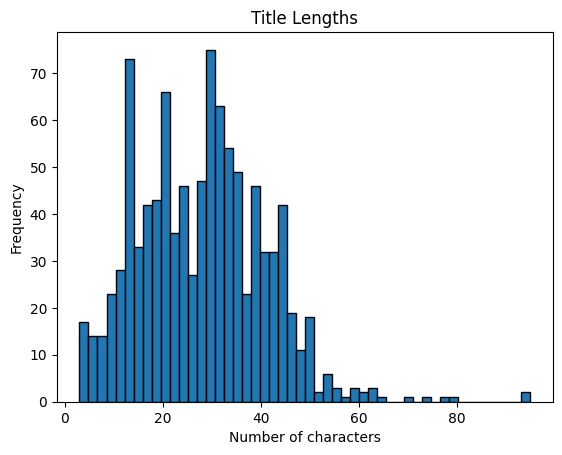

# **Wikipedia Text Categorization**
*A machine learning project by Cielo Loy for CSE 151A at UCSD*

Sections:
- [Introduction](#introduction)
- [Methods](#methods)
- [Results](#results)
- [Discussion](#discussion)
- [Conclusion](#conclusion)

## Introduction

**Our Goal: Can we use Wikipedia articles to learn how to identify the topic of arbitrary text between art/entertainment, geography, and STEM?**

**These three categories were chosen due to their broadness and distinctness from each other.**

Art/entertainment articles contain information about media and their creators.

Geography articles pertain to locations of the world.

STEM encompasses all articles related to science, technology, engineering, and math.

*Why was it chosen? Why is it cool? Discuss the general/broader impact of having a good predictive mode. i.e. why is this important?*

I chose to do a Wikipedia-based project because the information hosted there is incredibly vast, and I wanted to use machine learning to help me understand a little bit more of that vast wealth of knowledge. Text categorization helps us understand things by predicting the category of unseen texts, helping us glean knowledge about the texts without actually reading their entire content.

# Methods
### The Data
Here is a link to the dataset:
https://huggingface.co/datasets/wikimedia/structured-wikipedia

Structured Wikipedia is a dataset containing English and French Wikipedia articles and their attributes, though this project will pare that down to a smaller subset within the set of English-only articles. 

For the environment, let's use the following: 
- Python v3.13.5
- datasets v3.0 (for hugging-face)
- pandas v2.3.1
- numpy v2.3.2
- matplotlib v3.10.5
- scikit-learn v1.7.1
- seaborn v0.13.2

### Data Exploration

*How many observations does your dataset have?*

The English article dataset contains approximately 6.9 million observations. This dataset is 79.6 GB uncompressed. For the final project, we will elect to deal with only 600,000 articles. 

*Describe all columns in your dataset, their scales, and data distributions. Describe the categorical and continuous variables in your dataset. Describe your target column.*

The `16` features included for each article are:
| Feature | Description | Data Type | Scale | Continuous / Categorical |
|--|--|--|--|--|
| ***`name`*** | Title of the article | String | unlimited text | Categorical |
| `identifier`   | Unique Wikipedia article ID (three-part int) | Int64|Positive integers into the 100 millions | Categorical |
| ***`abstract`*** | Heading paragraph(s) at the top of the article | String | unlimited text | Continuous |
| `version` | Current version metadata (editor, edit size, etc.) | JSON dict | Variable | Mixed (mostly categorical)|
| `event`| Dates of creation and most recent publishing | JSON dict | Calendar dates | Continuous |
| `url`| Web URL linking to the article | String | range of unique urls | Categorical |
| `date_created` | Date of article creation | String | Calendar dates | Continuous|
| `date_modified`| Date of most recent publishing | String | Calendar dates | Continuous |
| `is_part_of ` | Identifies article as part of Wikipedia | JSON dict | always same value for this set | Categorical |
| `in_language`  | Language of the article (English)  | JSON dict | always same value for this set | Categorical |
| `license` | Creative Commons license info (name, ID, URL) | JSON list | Range of unique licenses used by articles, not many | Categorical |
| `description` | One-sentence summary of the article (frequently missing) | String | Variable | Continuous |
| `sections`| Section titles and texts of the article | JSON list | Variable | Continuous |
| ***`infoboxes`*** | Infobox object with basic topic facts | JSON list | Variable length / type| Mixed (categorical/cont.)|
| `main_entity` | Wikipedia QID + link to Wikidata page | JSON dict | range of unique QIDs and Wikidata urls | Categorical |
| `additional_entities` | same as main, with more attributes | JSON list | range of unique QIDs and Wikidata urls | Categorical |
| `image` | Header image metadata (URL, size, caption, alt text) | JSON dict | Variable | Mixed (categorical/cont.) |

Important features for this project are ***bolded and italicized*** in the table above. I am focusing primarily on text analysis and categorization. I will synthesize the target column, `category`, during preprocessing by filtering items from the `infobox` column. This target column will be a categorical int with range 3: a value of 0 for art/entertainment, 1 for geography, and 2 for STEM. The model will aim to predict this value for an arbitrary article after seeing its `name` and `abstract` text content.

*Do you have missing and duplicate values in your dataset?*

There are frequent missing values from the dataset, as not all articles are as detailed or complicated as others. There are few duplicates in the dataset since Wikipedia adheres to a unique ID system, but I will still check to see that unique articles weren't captured or linked to twice.

### Data Plots

The lengths of article titles are frequently between 5 and 50 characters long. Their range is from 0 to 100.

The lengths of abstracts are frequently between 0 and 1000 characters, dropping off after that. The longest samples are around 5000 characters in length.

### Data Preprocessing

*How will you preprocess your data? Handle data imbalance if needed.*

Categories will be identified using infobox type, if present. If not enough articles contain this data point, I will accumulate more by filtering the article abstracts with a list of keywords pertaining to each subject.

I will address data imbalance by paring down the dataset to 150,000 each for each of the 3 categories.

### Model 1

For initial experimentation, I have chosen to use a Naive Bayes model implemented with the `sklearn` library. The model will use TF-IDF for text categorization. For parameter tuning, let's implement 3 separate models with different choices for the `n-gram` parameter.

### Model 2

For further exploration, I have chosen to use a Support Vector Machine implemented with the `sklearn` library. The model will use TF-IDF for text categorization. Again for similar comparison, let's implement 3 separate models with different choices for the `n-gram` parameter.

# Results

## Naive Bayes Model Performance

## Unigram-only NB Performance (ngrams = (1,1))

## Bigram-only NB Performance (ngrams = (2,2))

## Support Vector Machine Model Performance

## Unigram-only SVM Performance (ngrams = (1,1))

## Bigram-only SVM Performance (ngrams = (2,2))

# Discussion
*Where does your model fit in the fitting graph?*

The initial Naive Bayes model seems appropriately fit. This question is investigated in the `Testing different parameters` section of the [notebook](wiki-model.ipynb).

*What are the next models you are thinking of and why?*

While the Naive Bayes model was chosen first for its simplicity and ease of text classification, our next model of choice is the Linear SVM. In Naive Bayes, the model assumes that all words are independent, which is not at all a true feature of language. For this reason, an SVM would recognize the relationships between words much better, and classify the text much more realistically for actual language, making significant improvements on this project's text classification abilities.

*Where does your model fit in the fitting graph?*

The SVM models all have better performance metrics and have more consistent values than the NB models. For this reason, I would say that the SVM models are appropriately fit. Furthermore, I tried tuning the n-gram parameter like in the last trial with Naive Bayes, making one model dedicated solely to unigrams (words) and one model dedicated solely to bigrams (phrases). The models with tuned parameters had similar metrics to the original SVM model with both unigrams and bigrams included.

*What are the next models you are thinking of and why?*

I would probably look at Logistic Regression next, since it calculates classification probabilities directly rather than assuming independence like Naive Bayes. I think this would have similar or better potential for text categorization as Linear SVM.

# Conclusion

*What is the conclusion of your 1st model? What can be done to possibly improve it?*

The Naive Bayes model ended up surprisingly more accurate than anticipated. Tuning the model with different n-gram parameters proved to be an effective exploration of other strategies, and the model using only bigrams showed the best results. The best model achieved a training accuracy score of `0.818` and a testing accuracy score of `0.777`. For further improvement, I could look at tuning the regularization parameter `alpha`, which I didn't test at all. 

*What is the conclusion of your 2nd model? What can be done to possibly improve it?*

The attempt at Support Vector Machine models outperformed the Naive Bayes classifiers by having consistently better metrics, and keeping this consistency even across changes in n-gram parameters. The best model achieved a training accuracy score of `0.889` and a testing accuracy score of `0.810`. Every SVM model outperformed every Naive Bayes classifier.

# Statement of Collaboration

Cielo Loy: all responsibilities